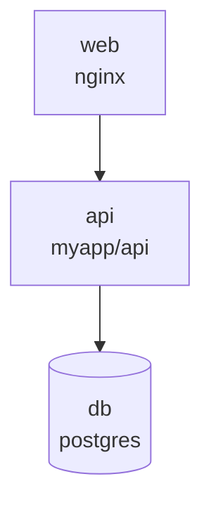

# 🗺 infra-diagram-gen

> **从 Infrastructure-as-Code 自动生成架构图。** 零依赖，一行命令。

[English](#english) | [中文](#中文)

```bash
python3 infra-diagram-gen.py docker-compose.yml
python3 infra-diagram-gen.py main.tf
python3 infra-diagram-gen.py k8s-deployment.yaml
```

## 中文

所有团队的架构文档都是过期的——因为你画完图代码就改了。

这个工具读取你的 IaC 文件（Docker Compose / Terraform / K8s），自动生成 Mermaid 格式的架构图。生成的 `.md` 文件直接贴到 GitHub README 里就会自动渲染。

### 支持的输入

| 文件类型 | 解析内容 |
|---------|---------|
| docker-compose.yml | services, depends_on, volumes, ports, replicas |
| Terraform (.tf) | resource blocks, reference relationships |
| Kubernetes YAML | Deployments, Services, Ingress, replicas, images |

### 输出示例



## English

Reads IaC files and generates Mermaid architecture diagrams. Zero dependencies (pure Python stdlib + regex parsing).

## License

MIT

---

<p align="center">🔍 搜「小薅薅」看更多运维工具</p>
---

<div align="center">

### 🫰 点击关注「小薅薅」

**年轻人的赛博工具箱** · 每天发现一个好玩的开源项目，为你节省 1 小时

📱 微信搜索公众号 **「小薅薅」** · 后台回复「工具」获取全部工具离线合集


</div>

> 💡 如果你懒得一个个翻项目，直接关注微信公众号 **小薅薅**，后台对话聊天就行了：
> - 回复「**运维**」→ 推荐运维/安全相关的开源项目
> - 回复「**工具**」→ 获取全部工具离线合集
> - 回复「**加群**」→ 加入交流群，一起搞事情

---

### 🔗 更多作品 · 点下方卡片查看

| 项目 | 描述 | 链接 |
|:---|:---|:---|
| **🛡 ops-skills** | 10个AI运维技能包，让Claude Code变成SRE专家 | [GitHub](https://github.com/tomlen045/ops-skills) · [Gitee](https://gitee.com/tomlen/ops-skills) |
| **🩺 ops-doctor** | 一条命令给Linux服务器做全套体检+健康分 | [GitHub](https://github.com/tomlen045/ops-doctor) · [Gitee](https://gitee.com/tomlen/ops-doctor) |
| **🔮 shellmbti** | 你的终端历史暴露了你是谁——Shell MBTI人格测试 | [GitHub](https://github.com/tomlen045/shellmbti) · [Gitee](https://gitee.com/tomlen/shellmbti) |
| **🧋 naicha-mbti** | 8道题测出你的奶茶人格，生成分享卡片 | [GitHub](https://github.com/tomlen045/naicha-mbti) · [在线玩](https://tomlen045.github.io/naicha-mbti/) |
| **🔥 fafa-generator** | 发疯文学生成器——一键生成发疯文案+卡片 | [GitHub](https://github.com/tomlen045/fafa-generator) · [在线玩](https://tomlen045.github.io/fafa-generator/) |
| **⏳ life-progress** | 人生进度条——把你的时间摆在眼前 | [GitHub](https://github.com/tomlen045/life-progress) · [在线玩](https://tomlen045.github.io/life-progress/) |
| **🪵 gongde-tap** | 电子木鱼功德计数器——赛博积德 | [GitHub](https://github.com/tomlen045/gongde-tap) · [在线玩](https://tomlen045.github.io/gongde-tap/) |
| **💞 mbti-match** | MBTI灵魂配对——神仙组合还是塑料同窗 | [GitHub](https://github.com/tomlen045/mbti-match) · [在线玩](https://tomlen045.github.io/mbti-match/) |

---

<div align="center">

**🎯 更多宝藏工具 · 手机点开即玩**

[🧋 奶茶MBTI](https://tomlen045.github.io/naicha-mbti/) | [🔥 发疯文学](https://tomlen045.github.io/fafa-generator/) | [⏳ 人生进度条](https://tomlen045.github.io/life-progress/) | [🪵 电子功德](https://tomlen045.github.io/gongde-tap/) | [💞 MBTI配对](https://tomlen045.github.io/mbti-match/)

**⭐ 觉得有用？给个 Star 让更多人看到 →**

[](https://github.com/tomlen045)

</div>
